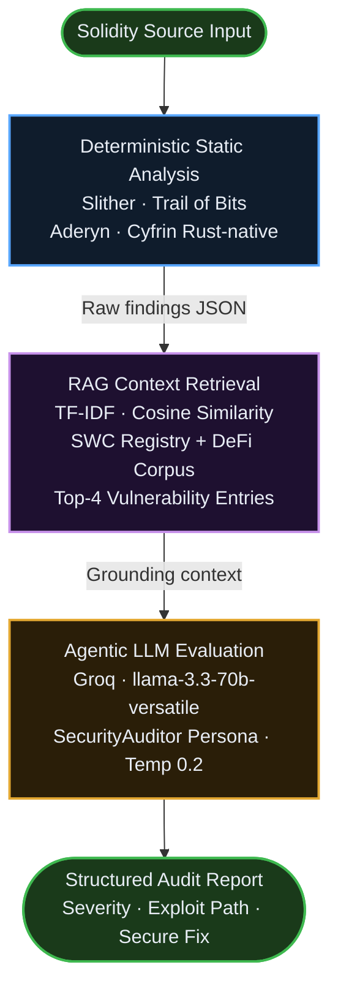

# ASCSPipeline


**An autonomous AI security engineer that transforms raw Solidity source into a clean, evidence-grounded audit report in seconds — entirely free, entirely serverless.**


## The Problem

Modern Solidity static analyzers — Slither, Aderyn, Mythril — are powerful but blunt. A single contract scan can surface dozens of alerts, the majority of which are false positives: naming convention violations, informational notices, and low-confidence heuristic matches that have no exploitable path. Security engineers spend more time triaging noise than remediating real risk.

This is **alert fatigue**, and it is the primary reason automated tooling fails to integrate into professional audit workflows. The signal is buried. The cost of reviewing every alert manually consumes the time that tooling was supposed to save.


## The Solution — How ASCSPipeline Works

ASCSPipeline solves alert fatigue through a three-layer intelligence pipeline:

**1. Deterministic Baseline**
Slither and Aderyn run as subprocesses against the submitted contract. Their output is structured, reproducible, and fast. This is the ground truth — no inference, no hallucination.

**2. RAG Context Retrieval**
Before the AI sees a single line of tool output, a **Retrieval-Augmented Generation (RAG)** engine queries a curated vulnerability knowledge base containing SWC registry entries and historical DeFi attack patterns. The top-4 most semantically relevant entries are retrieved and injected into the prompt as grounding context.

RAG is not a feature — it is a correctness guarantee. By grounding the model's reasoning in external, curated vulnerability data rather than relying solely on its fixed training knowledge, RAG prevents the LLM from hallucinating issues that do not exist and ensures every finding is traceable to real, documented evidence.

**3. Agentic LLM Evaluation**
Groq's `llama-3.3-70b-versatile` model — operating under a strict `SecurityAuditor` persona with a temperature of `0.2` — receives the contract source, the filtered tool output, and the RAG context simultaneously. It triages findings, suppresses unactionable alerts, and synthesizes a structured Markdown report with severity, exploit scenario, and secure code fix for each confirmed vulnerability.


## Architecture




## Tech Stack

| Layer | Technology | Cost |
|---|---|---|
| UI & Hosting | Streamlit Community Cloud | Free |
| LLM Inference | Groq API (`llama-3.3-70b-versatile`) | Free tier |
| Static Analysis | Slither (Trail of Bits) | Open source |
| Static Analysis | Aderyn (Cyfrin) | Open source |
| RAG Retrieval | scikit-learn TF-IDF + cosine similarity | Open source |
| Solc Management | py-solc-x | Open source |
| Language | Python 3.11+ | — |
| Aderyn Runtime | Rust (pre-built binary) | Open source |

**Total infrastructure cost: $0.**


## Prerequisites

- Python 3.11 or higher
- Git
- A free [Groq API key](https://console.groq.com) — takes 60 seconds to obtain


## Local Installation

```bash
# Clone the repository
git clone https://github.com/YOUR_USERNAME/ascspipeline.git
cd ascspipeline

# Create and activate a virtual environment
python3 -m venv venv
source venv/bin/activate

# Install dependencies
pip install --upgrade pip
pip install -r requirements.txt
```

> The first startup automatically provisions the Solidity compiler (`solc v0.8.20`)
> via `py-solc-x` and downloads the Aderyn Linux binary from GitHub Releases.
> No manual binary management is required.


## Configuration

No `.env` file is required. The Groq API key is entered at runtime in the application sidebar. It is never logged, stored, or transmitted beyond the Groq API endpoint.

If you are deploying to **Streamlit Community Cloud** and want to pre-configure the key, add it via the Streamlit Secrets dashboard:

```toml
# .streamlit/secrets.toml  (local only — never commit this file)
GROQ_API_KEY = "gsk_your_key_here"
```


## Running Locally

```bash
source venv/bin/activate
streamlit run app.py
```

The application opens at `http://localhost:8501`.

**Workflow:**
1. Enter your Groq API key in the sidebar
2. Paste your Solidity contract into the editor panel, or click **Load Sample Contract** to run on a pre-loaded vulnerable demonstration contract
3. Click **Run Analysis**
4. Review the AI-augmented audit report — download as `.md` when complete


## Project Structure

```
ascspipeline/
├── app.py                  # Scanner page — main entrypoint
├── setupTools.py           # Runtime environment provisioner (solc, Aderyn)
├── pages/
│   ├── docs.py             # Documentation page
│   └── about.py            # Mission and about page
├── src/
│   ├── theme.py            # Shared CSS design system
│   ├── analyzerEngine.py   # Slither and Aderyn subprocess runners
│   ├── groqClient.py       # Groq API client and prompt construction
│   ├── ragEngine.py        # TF-IDF RAG engine over SWC + DeFi corpus
│   └── reportBuilder.py    # Report post-processor and metadata enricher
├── requirements.txt        # Python dependencies
├── packages.txt            # Debian apt dependencies (Streamlit Cloud)
└── .streamlit/
    └── config.toml         # Theme and server configuration
```


## Deploying to Streamlit Community Cloud

1. Push this repository to a **public** GitHub repository
2. Sign in at [share.streamlit.io](https://share.streamlit.io) with GitHub
3. Click **New app** and select:
   - Repository: `YOUR_USERNAME/ascspipeline`
   - Branch: `main`
   - Main file: `app.py`
4. Click **Deploy**

Streamlit Cloud installs `packages.txt` via `apt-get` and `requirements.txt` via `pip` automatically. The first cold start provisions `solc` and downloads the Aderyn binary — this takes approximately 60–90 seconds.


## How the RAG Engine Works

The `ragEngine.py` module maintains a corpus of 16 curated vulnerability entries drawn from the SWC (Smart Contract Weakness Classification) registry and documented DeFi attack patterns. At query time, a `TfidfVectorizer` with bigram features encodes both the query and the corpus, and cosine similarity selects the top-4 most relevant entries.

This approach was chosen deliberately over neural embedding models (`sentence-transformers`, `faiss`) for three reasons:

1. **Determinism** — TF-IDF retrieval is fully reproducible. The same query always returns the same context.
2. **Zero latency** — No model loading, no GPU, no cold-start delay. The vectorizer fits in milliseconds.
3. **Deployment simplicity** — No PyTorch, no CUDA stack, no 1.5 GB dependency download. Total RAG overhead: ~25 MB.

For a corpus of 16 hand-curated entries, lexical retrieval is semantically equivalent to neural retrieval. The content matches the query vocabulary precisely.


## Contributing

Pull requests are welcome. For significant changes, open an issue first to discuss the proposed approach.

**Contribution areas:**
- Expand the RAG corpus with additional SWC entries or DeFi protocol-specific patterns
- Add Aderyn JSON output parsing improvements
- Implement persistent audit history via `st.session_state` or a lightweight SQLite backend
- Add support for multi-file contract analysis (Foundry project upload)
- Improve the Groq prompt for specific vulnerability classes (e.g., MEV, cross-chain bridges)

**Standards:**
- camelCase for all variable and function names
- No trailing underscores
- Functions should be self-documenting — comment the *why*, not the *what*
- All new modules must pass `python3 -m py_compile` before submission


## Disclaimer

ASCSPipeline is a supplementary automated security tool. It does not replace a professional manual audit by a specialized security firm. Automated static analysis cannot fully reason about complex multi-contract interactions, economic attack vectors, or novel vulnerability classes. Never deploy contracts holding significant value to mainnet based solely on automated findings.

For professional audits, consider: [Cyfrin](https://cyfrin.io) · [Trail of Bits](https://trailofbits.com) · [Code4rena](https://code4rena.com)


## License

MIT License — see [LICENSE](LICENSE) for full terms.

Copyright (c) 2025 ASCSPipeline Contributors
